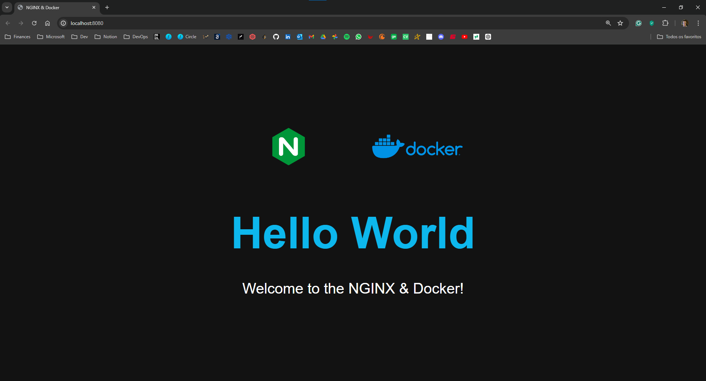

### Passo a Passo para Iniciantes em DevOps

#### 1. **Preparação do Ambiente**

Antes de iniciar, certifique-se de que seu ambiente de desenvolvimento está preparado:

- **Instale o Docker**: Siga as instruções para seu sistema operacional no site oficial do Docker [aqui](https://docs.docker.com/get-docker/).
- **Instale o Docker Compose**: O Docker Desktop já inclui o Docker Compose. Para instalações separadas, siga as instruções [aqui](https://docs.docker.com/compose/install/).

#### 2. **Primeiras Tarefas**

##### 2.1. Criar uma página HTML simples

1. **Crie um diretório para o projeto**:
   ```sh
   mkdir project
   cd project
   ```

2. **Dentro do diretório do projeto, crie um diretório `html`**:
   ```sh
   mkdir html
   ```

3. **Crie o arquivo `index.html` dentro do diretório `html`**:
   ```sh
   nano html/index.html
   ```

4. **Adicione o seguinte conteúdo ao `index.html`**:
   ```html
   <!DOCTYPE html>
   <html lang="en">
   <head>
       <meta charset="UTF-8">
       <meta name="viewport" content="width=device-width, initial-scale=1.0">
       <title>Hello World</title>
   </head>
   <body>
       <h1>Hello World</h1>
   </body>
   </html>
   ```

##### 2.2. Criar um container Docker com Nginx

1. **No diretório raiz do projeto, crie um arquivo `Dockerfile`**:
   ```sh
   nano Dockerfile
   ```

2. **Adicione o seguinte conteúdo ao `Dockerfile`**:
   ```Dockerfile
   FROM nginx:latest
   COPY html /usr/share/nginx/html
   ```

3. **Construa a imagem Docker**:
   ```sh
   docker build -t hello-nginx .
   ```

4. **Execute o container Docker**:
   ```sh
   docker run -d -p 8080:80 hello-nginx
   ```

5. **Verifique se o container está rodando e a página está acessível**:
   - Abra o navegador e acesse [http://localhost:8080](http://localhost:8080).
   - Você deve ver a mensagem "Hello World".

6. **Enviar evidências do resultado**:
   - Faça uma captura de tela da página "Hello World" no navegador.




##### 2.3. Configurar o Docker Compose

1. **No diretório raiz do projeto, crie um arquivo `docker-compose.yml`**:
   ```sh
   nano docker-compose.yml
   ```

2. **Adicione o seguinte conteúdo ao `docker-compose.yml`**:
   ```yaml
   version: '3'
   services:
     web:
       image: mynginx
       build: .
       ports:
         - "8080:80"
   ```

##### 2.4. Executar o Docker Compose

1. **Execute o Docker Compose**:
   ```sh
   docker-compose up -d
   ```

2. **Verifique se o container está rodando e a página está acessível**:
   - Abra o navegador e acesse [http://localhost:8080](http://localhost:8080).
   - Você deve ver a mensagem "Hello World".

### Resumo dos Tópicos Abordados

- **Criação de um arquivo HTML simples**
- **Criação e configuração de um Dockerfile**
- **Construção e execução de um container Docker**
- **Configuração de um arquivo `docker-compose.yml`**
- **Execução de containers usando Docker Compose**

### Tecnologias Utilizadas

- **HTML**
- **Docker**
- **Nginx**
- **Docker Compose**

### Próximos Passos

1. **Adicionar um servidor Flask para criar uma API simples.**
2. **Configurar o `docker-compose.yml` para incluir o serviço Flask.**
3. **Explorar a integração contínua (CI) e entrega contínua (CD) usando ferramentas como Jenkins ou GitHub Actions.**
4. **Configurar monitoramento e logging para os containers.**

### Evolução do Projeto

1. **Adicionar uma camada de banco de dados**:
   - Usar um contêiner de banco de dados como PostgreSQL.
   - Configurar a comunicação entre o serviço web e o banco de dados.

2. **Implementar um servidor de autenticação**:
   - Usar um contêiner para um servidor de autenticação, como Keycloak.
   - Integrar o servidor de autenticação com o serviço web.

3. **Automatizar testes e deploy**:
   - Configurar testes automatizados para a aplicação.
   - Implementar um pipeline de CI/CD para automação do deploy.

4. **Adicionar balanceamento de carga e escalabilidade**:
   - Configurar um balanceador de carga como NGINX ou HAProxy.
   - Explorar a escalabilidade horizontal usando Docker Swarm ou Kubernetes.

Com este passo a passo, você terá uma base sólida para iniciar sua jornada em DevOps e poderá expandir seu conhecimento e habilidades conforme avança no projeto.